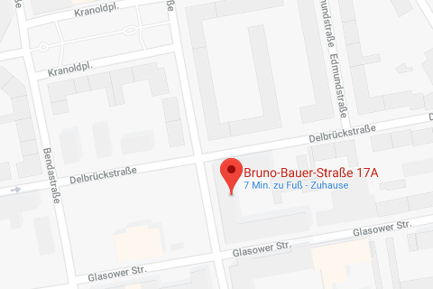

# Paul Fürst

**Paul Wilhelm Fürst** wurde am  am 14. April 1889 in Berlin geboren und betrieb einen selbstständigen Buchhandel in Berlin. Er war Inhaber von »Neukultur-« und »Kosmos«- Verlag. Von 1920 bis zu ihrem Verbot 1933 war Paul Fürst Mitglied der SPD und arbeitete auf der Neuköllner Geschäftsstelle oft ehrenamtlich mit. Zu der Zeit war er noch Justiz-Angestellter, ehe er sich später im kaufmännischen Beruf selbstständig machte. Er betätigte sich auch in der »Liga für Menschenrechte«.

Weil er »sozialistische und wissenschaftliche Bücher« vertrieb, erhielt er Anfang 1938 Berufsverbot. Sein gesamter Bücher-Bestand wurde im Dezember 1940 von der SA beschlagnahmt und Paul Fürst wurde von der Gestapo wegen illegaler Arbeit gegenüber dem Faschismus in »Schutzhaft« genommen und nach einigen Tagen in das KZ Sachsenhausen eingeliefert.

Ende Juni 1941 erhielt seine Mutte den Totenschein, wonach ihr Sohn am **6. Juni 1941** um 18:30 Uhr im Häftlingskrankenhaus des KZ Sachsenhausen an Kreislaufschwäche und doppelseitiger Lungenentzündung gestorben sei. Im Sterbebuch des Standesbeamten wird er als Kaufmann *Paul Wilhelm Fürst*, evangelisch, wohnhaft in Berlin, Gontardstraße 2 notiert. Wir wissen in Zusammenhang mit den »Grauen Bussen«, daß die Nazis absichtlich Daten verfälschten, um Spurensuche für Angehörige zu erschweren. So ist zu vermuten, daß die Nazis seine alte Geschäftsadresse als Wohnort notierten. Denn für sie war der Wohnsitz in der **Bruno-Bauer-Str. 17A** wohl weniger wichtig, als seine Verlags-Tätigkeit in der Gontardstraße am Alexanderplatz in Mitte. Telefonbuch-Einträge von Paul Fürst lauten ebenso auf den Geschäftssitz. Von der Familie, die unter dem Nazi-Regime bitteres Leid erfahren hat, läßt sich rekonstruieren: Die Ehe von Vater Matthäus Fürst und Mutter Ernestine Wilhelmine Pauline Fürst, geborene Wandrey wurde geschieden. Die Schwester Klara Hedwig Viktoria Staatz, geborene Fürst, starb am 18. Dezember 1944 in ihrer Wohnung in der Emser Straße 5. Sehr wahrscheinlich wohnte die Familie Fürst mit Mutter, Bruder und Schwester während der NS-Zeit hier in der III. Etage der Bruno-Bauer-Str. 17A. Sein Bruder Wilhelm schrieb: *»Was von 1933 – 1945 in Deutschland den Menschen an Verbrechen und Unmenschlichkeiten angetan wurde, hat auch Gott erzürnt und er wird den Schuldigen nie vergeben, niemals.«*

Während die hier am 14. März 1947 verstorbene Mutter als Opfer des Nationalsozialismus anerkannt wurde, blieb dem später in Moabit wohnenden Bruder Wilhelm im Jahr 1960 eine Entschädigung aufgrund Antragsfristablauf in 1958 verwehrt. Er erhielt lediglich eine »Sonderunterstützung« von 50 Reichsmark zum Tod der Mutter.

Der Stolperstein für Paul Fürst wurde am 29. November 2013 verlegt.

>