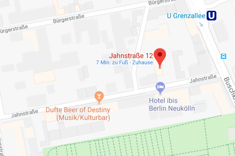

# Karl Tybussek

**Karl Tybussek** wurde am 4. Februar 1898 in Jedwabno, Kreis Neidenburg, im heutigen Polen, geboren. Das kleine Kirchdorf Jedwabno, früher Gedwangen geschrieben, liegt in Masuren, einem Gebiet im früheren Ostpreußen. Dieser Landstrich ist auch heute noch eine eher ärmlich, bäuerlich geprägte Region. Karl Tybussek ist das 10. und jüngste Kind des Kleinbauern *Michael Tybussek*. Nach der Volksschule ist er landwirtschaftlicher Arbeiter, wird 1917 zum Militär eingezogen. Nach seiner Entlassung wird er Hilfswachtmeister bei der Berliner Schutzpolizei, aus der er 1922 ausscheidet.

Mit Anfang zwanzig kam er nach Berlin, war dort begeisterter Anhänger des **Spartakusbundes**. Dann arbeitete erå als Ziegeleiarbeiter in Seidenberg, später beim Waggonbau in Görlitz und in verschiedenen anderen Betrieben. Seit 1923 ist Karl Tybussek Mitglied der KPD und Leiter der Ortsgruppe in Seidenberg. Wenig später lernte er in Berlin seine spätere Frau *Frieda Linke* kennen, die aus einem Nachbarort seiner Heimat Masuren, aus Seidenberg, stammte (und am gleichen Tag Geburtstag hatte, wie er).

Sie war nach Berlin in Stellung gegangen. 1922 ging er zurück nach Neidenburg, welches zu der Zeit noch deutsches Gebiet war. 1923 wurde der gemeinsame Sohn geboren. Es sollte das einzige Kind bleiben. 1924 heiratete er dort die 3 Jahre jüngere Frieda Linke. Sie arbeiteten dort im gleichen Betrieb, in dem Karl Tybussek eine Ortsgruppe der KPD gegründet hatte.

Wegen seiner politischen Einstellung verlor er bald darauf seine Arbeit. Auch seine Frau wurde kurze Zeit später entlassen, da sie ihren Mann nun eifrig bei seiner politischen Tätigkeit unterstützte. 1927 starb der gemeinsame Sohn, der erst 1923 zur Welt gekommen war.

1928 ging es zurück nach Berlin, wo beide in verschiedenen Betrieben arbeiteten. Sie hatten dort ihre politische Tätigkeit wieder aufgenommen und wurden kurz darauf beide erneut arbeitslos.

Ab 1933 wohnte das Ehepaar Tybussek in der **Jahnstraße 12** in Britz. Karl Tybussek arbeitete als Bauarbeiter. Politisch waren beide weiterhin aktiv. 1939 wurde Karl Tybussek als Soldat eingezogen und stieg 1940 zum Obregefreiten und 1941 zum Unteroffizier beim Bau- und Ersatzbattallion auf.

Anläßlich eines Fronturlaubes von Karl Tybussek im September 1942 wird über Möglichkeiten diskutiert, die Kriegsmaschinerie Deutschlands zu stören. Daraufhin entschließen sich Karl Tybussek und seine Freunde das Zweigwerk der deutschen Asbestwerke »Georgi, Reinhold & Co Berlin-Zehlendorf« in Seidenberg anzuzünden. Dieses Werk dient der Wiedergewinnung von Rohstoffen Gummi und Baumwolle aus alten Autoreifen. Dieser Betrieb ist der einzige dieser Art in Europa. Die wiedergewonnenen Rohstoffe sind wichtige Materialien für andere Industrien und von kriegsentscheidener Bedeutung, insbesondere für die Kabelindustrie. Am 13. September 1942 bricht ein Brand aus der wesentliche Teile des Werkes zerstört. 

Karl Tybussek, Leo Kolebski, Max Schicketanz sowie deren Ehefrauen werden am 9. April 1943 vom 2. Senat des Reichskriegsgerichts wegen Anstiftung zur Feinbegünstigung, Brandstiftung und Wehrmittelzerstörung angeklagt und verurteilt. Karl Tybussek, Leo Kolebski, Max Schicketanz werden zum Tode, die Ehefrauen zu Gefängnisstrafen.

Höchstwahrscheinlich wurde Karl Tybussek zusammen mit seiner Frau im Oktober 1942 verhaftet. Am 9. April 1943 nach dreitägigem Prozess vor dem Obersten Reichskriegsgericht wurde Karl Tybussek, *Leo Kolebski* und *Max Schicketanz* zum Tode durch Erhängen verurteilt, die Ehefrauen erhielten langjährige Gefängnisstrafen. Er wurde dann aus dem Berliner Gefängnis in Alt-Moabit am Exekutionstag, dem 26.05.1943 nach Brandenburg an der Havel in den Ortsteil Görden gebracht. Das Urteil wurde um 18 Uhr am gleichen Tag vollstreckt. Karl Tybussek, welcher konfessionslos war, verlor sein Leben mit 45 Jahren.

Frieda Tybussek, mittlerweile 44 Jahre alt und Witwe, kam zum Kriegsende aus dem Gefängnis frei, da die Rote Armee alle Insassen befreite. Von den ursprünglich 4 Jahren Zuchthaus, zu denen sie verurteilt worden war, hat sie zweieinhalb Jahre ihrer Haftstrafe verbüßt. In dieser Gefangenschaft mußte sie fast zwei Jahre Zwangsarbeit in einem Rüstungsbetrieb ableisten.

Frau Tybussek zog dann in eine Wohnung in der Fritz–Reuter-Allee 57. Ob sie dort bis zu ihrem Lebensende wohnte ist nicht bekannt.

Der Stolperstein für Karl Tybussek wurde am 29. November 2012 verlegt.