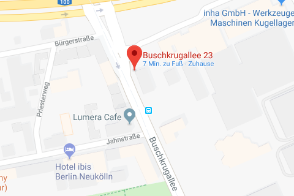

# Familie Wittenberg

In der **Buschkrugallee 21-23** (damals Rudower Straße 92) wohnten die Eheleute **Benno und Hedwig Wittenberg** mit ihren Söhnen **Erwin** und **Siegfried**. Gleich neben ihrer Wohnung befand sich das Geschäft und das Lager der *Baumaterialienhandlung Benno Wittenbergs*, bevor es 1938 durch die Nationalsozialisten »arisiert« wurde. Herr Wittenberg mußte sein Geschäft mit großem Verlust an die Firma *»Karosserie Glaubschat«* verkaufen.

Benno Wittenberg und seine Frau Hedwig flohen daraufhin nach Prag und wurden am 10. Dezember 1941 zunächst nach Theresienstadt und dann im Jahr darauf, Anfang April 1942, ins Ghetto Piaski deportiert, wo sie von den Nazis im Zuge der Aktion Reinhardt ermordet wurden.

Ihren Söhnen Erwin und Siegfried, beide zuvor im Geschäft der Eltern tätig, gelang die Flucht jeweils von Prag nach England beziehungsweise Palästina, wo sie überleben konnten.

Die Stolpersteine für die Familie Wittenberg wurden am 19, September 2013 verlegt.