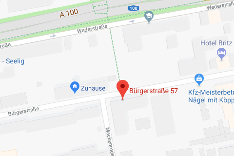

# Samson Baruch Wurzel und Tochter Anna Wurzel

In den dreißiger Jahren gab es ein Tabakwarengeschäft in der Bürgerstraße 31, dessen  jüdischer Geschäftsinhaber **Samson Baruch Wurzel** und seine Tochter **Anna Wurzel** in der **Bürgerstraße 57** wohnten. Samson Baruch Wurzel wurde am 22.12.1858 im galizischen Debica in Polen geboren. Er war mit *Sara Wurzel*, geboren am 02.04.1864 als *Sara Singer*, verheiratet. Sie stammte aus Dabrowa, starb aber schon am 10.04.1930 im Alter von 66 Jahren und ist auf dem jüdischen Friedhof Weißensee bestattet. Zusammen sollen sie drei Kinder gehabt haben.

Samson Baruch Wurzel hatte eine Tochter, namens Anna, welche ihn im Geschäft aufgrund seines hohen Alters unterstützte. Neben der Tochter, die am 03.09.1896 in Tarnów geboren wurde, gab es noch zwei Söhne, vermutlich einen jüngeren und einen älteren Bruder. Der jüngere der beiden hieß Josef und wohnte ebenfalls bis ca. 1932/33 in der Bürgerstr. 57a. Er soll 1907 geboren worden sein. Er meldete im Jahre 1930 die Beerdigung seiner Mutter Sara an und ist noch 1931 im jüdischen Adressbuch verzeichnet. Er soll nach Krakau zurückgegangen sein. Wann genau kann man nicht mehr feststellen, danach verliert sich jede Spur. Zuletzt soll er in einem Lager dort gewesen sein. Im Gedenkbuch der Freien Universität ist er als verfolgt eingetragen. Er war im Jahr 1943 wohl nicht mehr am Leben, da ihn sein Vater unter der Rubrik Kinder in seiner Vermögenserklärung aus dem Jahr 1943 kurz vor seiner Deportation nicht mehr eingetragen hatte. Seine Tochter Anna hatte er dort, als außerhalb des Haushalts lebend, fein säuberlich vermerken lassen. Auch sein erstgeborener Sohn, dessen Vorname nicht mehr ermittelt werden kann, soll im Ersten Weltkrieg als Offizier gefallen sein und wird von ihm nicht mehr erwähnt.

Am 9. November 1938 zerstörte die SS Samson Wurzels Geschäft. Die Scheiben wurden eingeschlagen und das Geschäft gnadenlos ausgeplündert. Samson Wurzel war zu dieser Zeit schon ein Mann von 80 Jahren. Sicherlich führte die Tochter bis dato überwiegend das Tabakwaren-Geschäft mit ihrem Vater.

Einige Zeit später, Herr Wurzel war nun schon 85 Jahre alt, musste er sich ins Israelitische Krankenhaus in der Elsässerstr. 85, heute Torstr., in Mitte begeben. Von dort aus wurde er dann nach Theresienstadt ins Ghetto deportiert. Dies war am 28.05.1943 und war der 90. Alterstransport. Mit diesem wurden nur etwa 330 alte Menschen abtransportiert. Zwei Tage zuvor musste er noch eine sog. Vermögenserklärung abgeben. Samson Wurzel hatte im Ghetto in Theresienstadt noch Monate überlebt, wurde aber schließlich am 01.02.1944 ermordet. Seine Urne war ursprünglich dort im Kolumbarium der Befestigungsanlage aufbewahrt. Es wurde aber 1944 fast vollständig ausgeräumt und die Asche der Urnen in den Fluß Ohře gestreut, wo sich heute eine Gedenktafel für die Opfer befindet. Man wollte so die hohe Sterblichkeitsrate in Theresienstadt verbergen.

Im September 1942 zog Anna kurzzeitig in die Hirtenstr. 1-2 zur Untermiete bei einer Frau Steinberg -- vielleicht fühlte sie sich aber auch dazu gezwungen. Die Straße befand sich nämlich im ehemaligen Scheunenviertel. Freiwillig sind Juden um 1943 jedenfalls eher nicht dorthin gezogen, da es von dort meist direkt zur Deportation ging. Dort wurden gezielt jüdische Menschen angesiedelt und vorsorglich gesammelt. Anna Wurzel wurde wenig später, am 19. Februar 1943, mit dem 29. Transport nach Auschwitz-Birkenau deportiert, konnte sich von da an also nicht mehr um ihren kranken Vater kümmern.

Anna Wurzel war nie verheiratet und soll in Auschwitz umgekommen sein, das genaue Todesdatum läßt sich nicht mehr rekonstruieren. Vielleicht hat man sie kurz nach der Ankunft getötet, vielleicht hat sie noch einige Monate unter härtesten Bedingungen überlebt. Wir wissen es leider nicht, da alle Aufzeichnungen damals vernichtet wurden und auch über sie keine Akten mehr existieren. Ihr Leben endete dort um das Jahr 1943, der Todestag ist unbekannt, so sagt es ein lapidarer Vermerk. Auch von Sohn Josef verliert sich jede Spur in einem Ghetto in Krakow.

Die beiden Stolpersteine für Samson Baruch Wurzel und seine Tochter Anna wurden am **9. September 2017** verlegt.